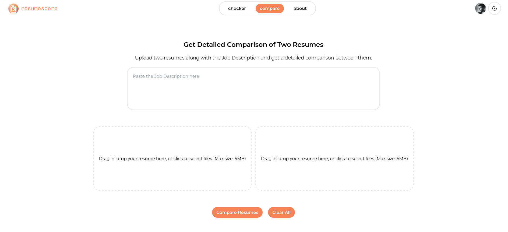
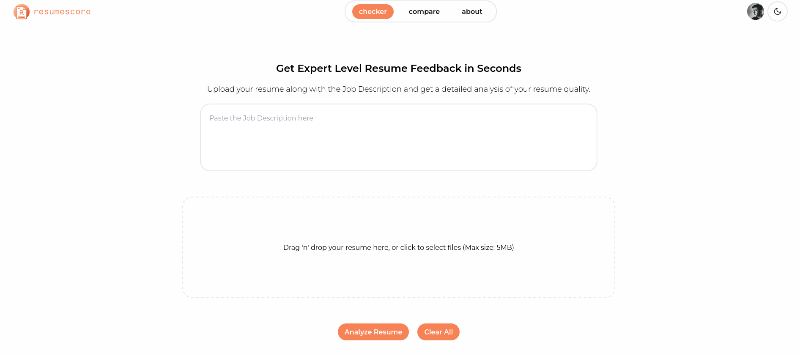
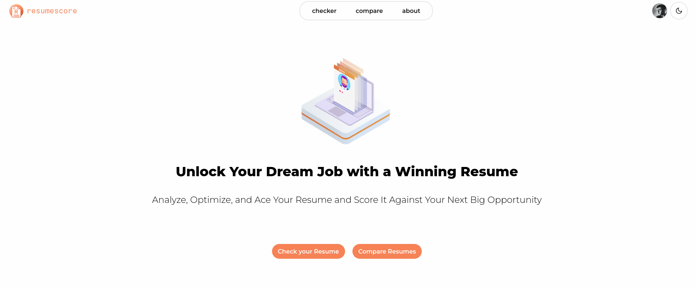
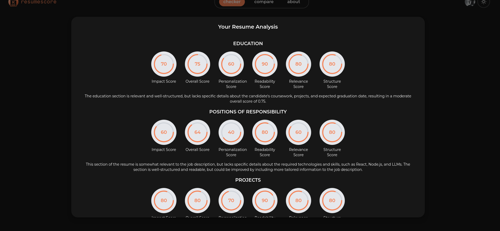

# Resume Score App

This project aims to help job seekers improve their resumes by providing detailed analysis and comparison of their resumes with the job description. The project is built using React, Tailwind CSS, and Clerk.dev for authentication on the frontend and Python, Langchain, Unstructured and Groq on the Backend.

## Screenshots

## Features

- Upload and analyze resumes
- Compare two resumes against a job description
- Detailed section-wise analysis and scoring
- Download analysis and comparison as PDF
- Dark mode support

## Installation

- Run `npm i` for install npm packages
- Create a Virtual Environment and install the packages in requirements.txt
- Create 2 .env files - One in root('/') folder and Another in server folder
- In root folder '.env' add VITE_CLERK_PUBLISHABLE_KEY (Clerk Publishable Key) and VITE_SERVER_URL (Default should be http://localhost:5000)
- In server folder '.env' add GROQ (Groq API key)
- Start Frontend with 'npm run dev' on one terminal and Backend with 'npm run server' on another terminal.

## Usage

- Open your browser and navigate to http://localhost:5173.
- Sign in using Clerk.dev authentication.
- Upload your resume and job description to get a detailed analysis.
- Compare two resumes against a job description to get a detailed comparison.

## Contributing

Contributions are welcome! Please follow these steps:

- Fork the repository.
- Create a new branch (git checkout -b feature-branch).
- Make your changes.
- Commit your changes (git commit -m 'Add some feature').
- Push to the branch (git push origin feature-branch).
- Open a pull request.
